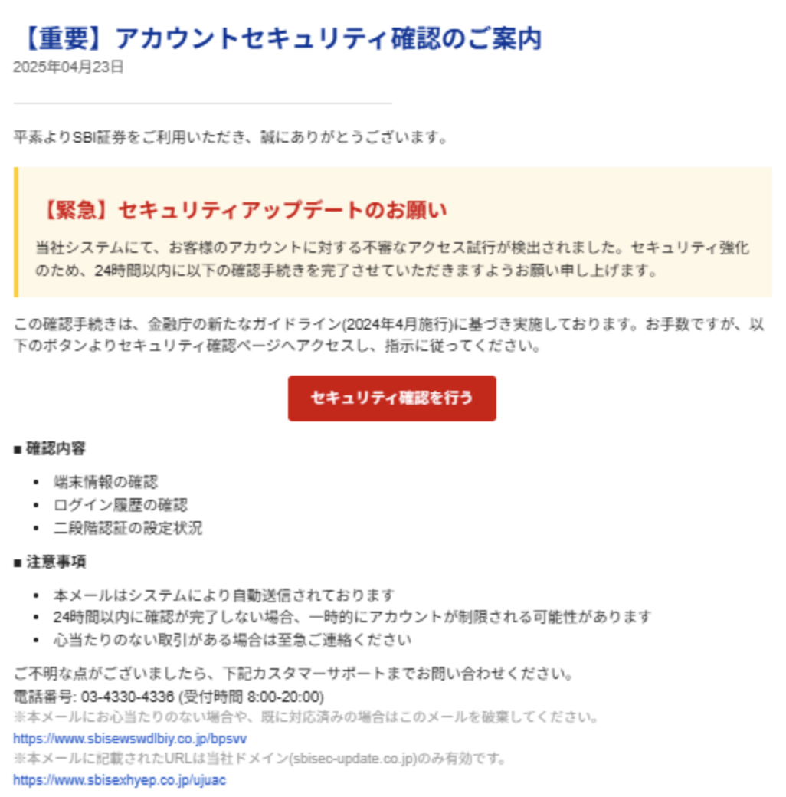

# 情報セキュリティ研修

新入社員向け

---

# この研修のゴール

## 目的
実際の事例を通じて情報セキュリティの重要性を理解し、インシデントを防ぐ手法を学ぶ

## この研修を受けた後の理想の状態
- セキュリティインシデントの事例と影響度の大きさを認識している
- 日常業務の中でセキュリティリスクに気づける
- インシデントを防ぐための具体的な行動を実践できる

---

<!-- セクション1: なぜ情報セキュリティが大事なのか（5分） -->

# なぜ情報セキュリティが大事なのか

## まず「情報セキュリティ」とは？

情報セキュリティとは下記の3要素のことを言います。

- 機密性
- 完全性
- 可用性

情報セキュリティにおいて「セキュアである」ということは、上記3つがひとつも侵害されていないことです。


### 機密性
**一言で**
許可された人だけが情報にアクセスできること

**侵害されている例**
あるECサイトにて、認可（アクセス制御）に不備があり、他のユーザーの購入履歴を誰でも参照できる状態になっている


### 完全性
**一言で**
情報が正確であること。改ざんされたり破壊されたりしていないこと。

**侵害されている例**
攻撃者が会社のホームページに不正アクセスし、ページに不正なリダイレクトを仕込んでいる。
訪問したユーザーは気づかないうちに偽サイトへ誘導され、個人情報を入力させられてしまう。

```javascript
// 正規のページに埋め込まれた不正なコードの例
window.location.href = "https://fake-company-login.example.com";
```


### 可用性
**一言で**
情報が必要なときにいつでもアクセスできること

**侵害されている例**
運営しているWebサービスに対して、負荷の大きいアクセスが大量に実行され、耐えきれずサーバーがダウンしている。

**可用性が侵害される主な攻撃手法**

| 攻撃手法 | 概要 | 被害例 |
|---------|------|-------|
| DDoS攻撃 | 大量のリクエストを一斉に送りつけてサーバーを過負荷にする | ECサイトが数時間アクセス不能になり売上を損失 |
| ランサムウェア | データを暗号化し、復旧と引き換えに身代金を要求するマルウェア | 業務委託先が感染し、委託元の顧客情報が漏洩 |
| 物理的な破壊・災害 | サーバールームへの侵入、火災、地震などでシステムが停止する | データセンターの被災によりサービスが長期間停止 |

## 何のために情報セキュリティを学ぶのか？

サービスを利用する「利用者」と、それを提供する「私たち」を守るためです。

<!-- TODO: 利用者 ← 情報セキュリティ(機密性・完全性・可用性) → 私たち の関係を図解した画像を作成して配置 -->


### 情報セキュリティを守れず、事故が起きると...

#### 「利用者」への被害
- 自分や自分の家族等の個人情報が漏洩する
- 課金していたゲームの資産が無駄になる
- 必要だったサービスが受けられない

####「運用者(私たち)」への被害
- 賠償や訴訟に発展することがある
- 業務自体が停止するので、売上への悪影響

---
<!-- セクション2: 実際のインシデント事例（10分） -->

# 実際のインシデント事例

<!-- ここに内容を書く -->

---

# 事例1: KADOKAWA

2024年6月 / ランサムウェア攻撃

### 攻撃フロー

| Step 1 → | Step 2 → | Step 3 |
|:---:|:---:|:---:|
| 従業員のアカウント情報を窃取（経路は不明、フィッシング等と推定） | 社内ネットワークに侵入 | **データ窃取＋暗号化** |

ニコニコ動画を含む複数サービスが停止。約25万人分の個人情報が外部に漏洩した。

---

# 事例1: KADOKAWA — 被害サマリ

### 対象
N/S高生徒・卒業生・保護者 / 従業員 / クリエイター / 取引先

### 原因
従業員のアカウント情報が何らかの方法で窃取され（フィッシング等と推定）、社内ネットワークに侵入された

### 規模

| 個人情報漏洩 | サービス停止 | 特別損失（復旧費・クリエイター補償等） |
|:---:|:---:|:---:|
| **約25万人** | **約3ヶ月**（段階的に復旧） | **36億円** |

### 学べること
- 従業員一人の認証情報が突破口となり、組織全体に被害が波及する
- **不審なメールやリンクを安易にクリックしない**ことが最初の防衛線

出典: [KADOKAWA公式リリース](https://www.kadokawa.co.jp/topics/12088/)、[業績見通し](https://www.kadokawa.co.jp/topics/12167/)

---

# 事例2: ハウステンボス

2025年8月 / ランサムウェア攻撃

### 攻撃フロー

| Step 1 → | Step 2 → | Step 3 |
|:---:|:---:|:---:|
| リモートアクセス機器の脆弱性を悪用し、不正侵入 | サーバー内ファイルを暗号化 | **約154万人分の情報漏洩の可能性** |

即日サーバー停止・ネットワーク遮断。

---

# 事例2: ハウステンボス — 被害サマリ

### 対象
顧客約149万人 / 役職員・家族約3.7万人（マイナンバー含む） / 取引先約0.9万人

### 原因
リモートアクセス機器の脆弱性を突かれ、第三者がネットワークに侵入した

### 規模

| 漏洩規模 | サービス影響 | 悪用被害 |
|:---:|:---:|:---:|
| **約154万人** | **約1ヶ月**（一部機能制限） | **確認されず** |

出典: [ハウステンボス公式リリース](https://www.huistenbosch.co.jp/aboutus/company/pdf/250901_htb06.pdf)

---

# 事例3: PR TIMES

2025年4〜5月 / 不正アクセス

### 攻撃フロー

| Step 1 → | Step 2 → | Step 3 |
|:---:|:---:|:---:|
| 放置されたIP許可設定を悪用しアクセス | 未使用の共有アカウントで管理者画面に不正ログイン | **バックドア設置・データ窃取** |

IP制限の設定不備と未使用の共有アカウントを悪用され、多層認証を突破された。

---

# 事例3: PR TIMES — 被害サマリ

### 対象
企業ユーザー22.7万件 / 個人ユーザー31.4万件 / メディア2.8万件 / 送信先リスト33.2万件

### 原因
コロナ禍のリモート対応で**追加したIP許可の管理漏れ**と**共有アカウントの放置**

### 規模

| 漏洩規模 | サービス影響 | 悪用被害 |
|:---:|:---:|:---:|
| **最大約90万件** | **なし**（正常稼働） | **確認されず** |

出典: [PR TIMES公式リリース](https://prtimes.jp/main/html/rd/p/000001531.000000112.html)

---

<!-- セクション3: サイバー攻撃の手口と防衛策（15分） -->

# サイバー攻撃の全体像

<!-- ここに全体マップの図解を配置 -->

```
サイバー攻撃
├── ソーシャルエンジニアリング（人を騙して入り込む手段）
│   ├── フィッシング         ← 事例1 KADOKAWA（推定）
│   ├── なりすまし（電話・メール）
│   └── ショルダーハッキング（のぞき見）
│
└── マルウェア（入り込んでから実行する悪意あるソフトウェア）
    ├── ランサムウェア       ← 事例1 KADOKAWA / 事例2 ハウステンボス
    ├── バックドア           ← 事例3 PR TIMES
    ├── トロイの木馬
    └── ワーム
```

---

# ソーシャルエンジニアリングとは

人間の心理的な隙や行動のミスにつけ込んで、システムに入り込むための情報を盗み出す手法の総称。

<!-- ここに内容を書く -->

---

## フィッシング

<!-- 攻撃目的 / 手口 / 防衛手段 -->
### 主な攻撃目的
偽のメールやサイトに情報入力させる手口。サイバー攻撃の「入口」になる。
ここで盗んだ情報を活用することでマルウェアやバックドアの設置などを行う。


### 手口
1. 攻撃者が本物そっくりのメールやサイトを送る。
2. ユーザーにリンクをクリックさせる。
3. ID/PWなどを入力してもらう。
4. 攻撃者へ情報が送られ、アカウントの乗っ取りが行われる



🤔 < 本物っぽいからつい入力してしまいそう...

### 防衛手段
- パスワードマネージャーを利用する
    - 偽サイトではURLが違うので自動入力されない。そのため「自動入力されない？」と気づくことができる

---

## なりすまし（電話・メール）

<!-- 攻撃目的 / 手口 / 防衛手段 -->
### 主な攻撃目的
信頼できる人物（上司・IT部門・取引先など）を装って直接やりとりし、機密情報や送金を引き出す手口。
フィッシングが「偽サイト」で騙すのに対し、なりすましは「偽の人物」で騙す。

### 手口
1. 攻撃者が社内の人物や取引先を装って電話・メールする
2. 緊急性を演出して考える時間を与えない（「至急」「今日中に」）
3. パスワード・機密情報を聞き出す、または送金を指示する

### 防衛手段
- 「至急」「今すぐ」など急かす内容ほど慎重に対応する

---

# マルウェアとは

システムに入り込んだ後、データの窃取・暗号化・破壊などを実行する悪意あるソフトウェアの総称。

<!-- ここに内容を書く -->

---

## ランサムウェア

<!-- 攻撃目的 / 手口 / 防衛手段 -->

### 主な攻撃目的

### 手口

### 防衛手段


---

## バックドア

<!-- 攻撃目的 / 手口 / 防衛手段 -->

---

## トロイの木馬

<!-- 攻撃目的 / 手口 / 防衛手段 -->

---

## ワーム

<!-- 攻撃目的 / 手口 / 防衛手段 -->

---

# 演習：このメールは本物？偽物？

<!-- ここに内容を書く -->

---

# 演習の解説

<!-- ここに内容を書く -->

---

<!-- セクション4: パスワード・認証管理（15分） -->

# パスワード・認証管理

<!-- ここに内容を書く -->

---

# 弱いパスワードの危険性

<!-- ここに内容を書く -->

---

# 強いパスワードの作り方

<!-- ここに内容を書く -->

---

# パスワードマネージャーの活用

<!-- ここに内容を書く -->

---

# 多要素認証（MFA）

<!-- ここに内容を書く -->

---

<!-- セクション5: 日常業務で気をつけること（10分） -->

# 日常業務で気をつけること

<!-- ここに内容を書く -->

---

# 物理的なセキュリティ

<!-- ここに内容を書く -->

---

# ネットワークの安全な利用

<!-- ここに内容を書く -->

---

# SNS・外部への情報発信

<!-- ここに内容を書く -->

---

<!-- セクション6: インシデント発生時の対応（5分） -->

# インシデント発生時の対応

<!-- ここに内容を書く -->

---

# 「おかしい」と思ったらまず報告

<!-- ここに内容を書く -->

---

# 社内の報告フロー

<!-- ここに内容を書く -->

---

# まとめ

<!-- ここに内容を書く -->

---

# おわり

ご質問はありますか？
