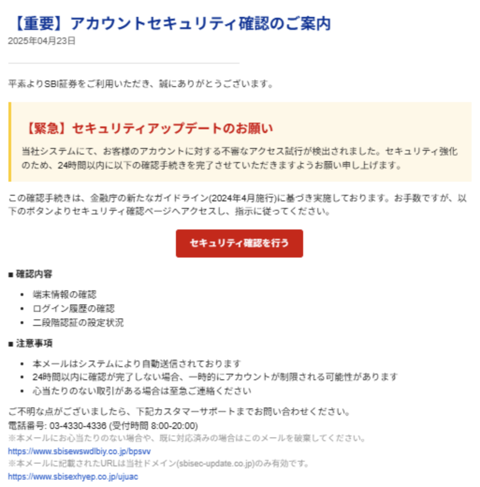
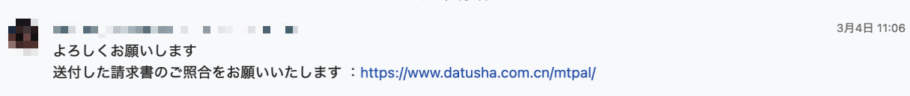

<!-- _class: lead -->
<!-- _paginate: false -->

# 情報セキュリティ研修

新入社員向け / 2026.04.03

---

# 自己紹介

::::c-7-3
:::_
## 國分 拓也（くぶたく）

**所属** — グロースハックチーム / データエンジニア

**担当** — データ基盤の構築・運用（2023年入社）

**趣味** — ダンス / ゲーム / RADWIMPS

日常的にデータを扱うからこそ、情報セキュリティは身近なテーマ。
:::

:::_

:::
::::

---

# この研修のゴール

実際の事例を通じて情報セキュリティの重要性を理解し、インシデントを防ぐ手法を学ぶ

::::c3
:::_ {.panel-sq}
**知る**

事例と被害の大きさを
認識する
:::

:::_ {.panel-sq}
**気づく**

日常業務の中で
リスクを見つけられる
:::

:::_ {.panel-sq}
**動ける**

具体的な防衛策を
実践できる
:::
::::

---

<!-- _class: section -->

# なぜ情報セキュリティが大事なのか

---

<!-- header: なぜ情報セキュリティが大事なのか -->

# 情報セキュリティとは？

::::c3
:::_ {.panel-sq}
**機密性**

許可された人だけが
アクセスできる
:::

:::_ {.panel-sq}
**完全性**

情報が正確で
改ざんされていない
:::

:::_ {.panel-sq}
**可用性**

必要なときにいつでも
アクセスできる
:::
::::

「セキュアである」とは、上記3つがひとつも侵害されていないこと。

---

# 機密性

::::c-7-3
:::_
## 許可された人だけが情報にアクセスできること

**侵害されている例**
あるECサイトにて、認可（アクセス制御）に不備があり、他のユーザーの購入履歴を誰でも参照できる状態になっている
:::

:::_ {.panel-accent}
**ポイント**

「誰が見られるか」の制御が重要
:::
::::

---

# 完全性

::::c-7-3
:::_
## 情報が正確であること。改ざんや破壊がされていないこと。

**侵害されている例**
攻撃者が会社のホームページに不正アクセスし、不正なリダイレクトを仕込んでいる。訪問したユーザーは偽サイトへ誘導され、個人情報を入力させられてしまう。
:::

:::_ {.panel-accent}
**ポイント**

「情報が正しいか」の保証が重要
:::
::::

---

# 可用性

::::c-7-3
:::_
## 情報が必要なときにいつでもアクセスできること

**侵害されている例**
運営しているWebサービスに対して、負荷の大きいアクセスが大量に実行され、耐えきれずサーバーがダウンしている。
:::

:::_ {.panel-accent}
**ポイント**

「いつでも使える」状態の維持が重要
:::
::::

---

# 可用性が侵害される主な攻撃手法

| 攻撃手法 | 概要 |
|---------|------|
| DDoS攻撃 | 大量のリクエストでサーバーを過負荷にする |
| ランサムウェア | データを暗号化し、身代金を要求する |
| 物理的な破壊・災害 | 火災・地震などでシステムが停止する |

---

# 何のために情報セキュリティを学ぶのか？

サービスを利用する「利用者」と、それを提供する「私たち」を守るため。

---

# 情報セキュリティを守れず、事故が起きると...

::::c
:::_
## 「利用者」への被害

- 個人情報が漏洩する
- 必要だったサービスが受けられない
- 対応コストがかかる（パスワード変更や口座監視など）
:::

:::_
## 「運用者（私たち）」への被害

- 賠償や訴訟に発展することがある
- 業務自体が停止し、売上への悪影響
:::
::::

---

<!-- _class: section -->

# 実際のインシデント事例

---

<!-- header: 実際のインシデント事例 -->

# 事例1: KADOKAWA

2024年6月 / ランサムウェア攻撃

### 攻撃フロー

:::_ {.panel-card}
**Step 1** → 従業員のアカウント情報を窃取（フィッシング等と推定）
:::

:::_ {.panel-card}
**Step 2** → 社内ネットワークに侵入
:::

:::_ {.panel-card}
**Step 3** → データ窃取＋暗号化
:::

ニコニコ動画を含む複数サービスが停止。約25万人分の個人情報が漏洩。

---

# 事例1: KADOKAWA — 被害サマリ

**対象:** N/S高生徒・卒業生・保護者 / 従業員 / クリエイター / 取引先

**原因:** 従業員のアカウント情報がフィッシング等で窃取され、社内ネットワークに侵入された

| 個人情報漏洩 | サービス停止 | 特別損失 |
|:---:|:---:|:---:|
| **約25万人** | **約3ヶ月** | **36億円** |

---

# 事例1: KADOKAWA — 学べること

- 従業員一人の認証情報が突破口となり、組織全体に被害が波及する
- **不審なメールやリンクを安易にクリックしない**ことが最初の防衛線

出典: [KADOKAWA公式リリース](https://www.kadokawa.co.jp/topics/12088/)、[業績見通し](https://www.kadokawa.co.jp/topics/12167/) {.text-sm .gray}

---

# 事例2: ハウステンボス

2025年8月 / ランサムウェア攻撃

### 攻撃フロー

:::_ {.panel-card}
**Step 1** → リモートアクセス機器の脆弱性を悪用し不正侵入
:::

:::_ {.panel-card}
**Step 2** → サーバー内ファイルを暗号化
:::

:::_ {.panel-card}
**Step 3** → 約154万人分の情報漏洩の可能性
:::

即日サーバー停止・ネットワーク遮断。

---

# 事例2: ハウステンボス — 被害サマリ

**対象:** 顧客約149万人 / 役職員・家族約3.7万人（マイナンバー含む） / 取引先約0.9万人

**原因:** リモートアクセス機器の脆弱性を突かれ、第三者がネットワークに侵入

| 漏洩規模 | サービス影響 | 悪用被害 |
|:---:|:---:|:---:|
| **約154万人** | **約1ヶ月** | **確認されず** |

出典: [ハウステンボス公式リリース](https://www.huistenbosch.co.jp/aboutus/company/pdf/250901_htb06.pdf) {.text-sm .gray}

---

# 事例3: PR TIMES

2025年4〜5月 / 不正アクセス

### 攻撃フロー

:::_ {.panel-card}
**Step 1** → 放置されたIP許可設定を悪用しアクセス
:::

:::_ {.panel-card}
**Step 2** → 未使用の共有アカウントで管理者画面に不正ログイン
:::

:::_ {.panel-card}
**Step 3** → バックドア設置・データ窃取
:::

IP制限の設定不備と未使用の共有アカウントを悪用され、多層認証を突破。

---

# 事例3: PR TIMES — 被害サマリ

**対象:** 企業ユーザー22.7万件 / 個人ユーザー31.4万件 / メディア2.8万件 / 送信先リスト33.2万件

**原因:** コロナ禍のリモート対応で**追加したIP許可の管理漏れ**と**共有アカウントの放置**

| 漏洩規模 | サービス影響 | 悪用被害 |
|:---:|:---:|:---:|
| **最大約90万件** | **なし** | **確認されず** |

出典: [PR TIMES公式リリース](https://prtimes.jp/main/html/rd/p/000001531.000000112.html) {.text-sm .gray}

---

<!-- _class: section -->

# サイバー攻撃の手口と防衛策

---

<!-- header: サイバー攻撃の手口と防衛策 -->

# サイバー攻撃の全体像

::::c
:::_ {.panel-card}
### ソーシャルエンジニアリング
人を騙して入り込む手段

- フィッシング
- なりすまし（電話・メール）
- ショルダーハッキング（のぞき見）
:::

:::_ {.panel-card}
### マルウェア
入り込んでから実行する悪意あるソフトウェア

- ランサムウェア
- バックドア
- トロイの木馬
- ワーム
:::
::::

---

<!-- _class: section -->

# ソーシャルエンジニアリング

人間の心理的な隙や行動のミスにつけ込んで、システムに入り込むための情報を盗み出す手法の総称

---

<!-- _class: compact -->

# フィッシング

## 偽のメールやサイトに情報を入力させる手口

サイバー攻撃の「入口」になる。ここで盗んだ情報でマルウェアやバックドアの設置を行う。

### 手口

:::_ {.panel-card}
**Step 1** → 攻撃者が本物そっくりのメールやサイトを送る
:::

:::_ {.panel-card}
**Step 2** → ユーザーにリンクをクリックさせる
:::

:::_ {.panel-card}
**Step 3** → ID/PWなどを入力させる
:::

:::_ {.panel-card}
**Step 4** → 攻撃者へ情報が送られ、アカウントが乗っ取られる
:::

---

# フィッシングメールの例

---

# フィッシングへの防衛手段

:::_ {.panel-card}
**パスワードマネージャーを利用する**
偽サイトではURLが違うので自動入力されない。「自動入力されない？」と気づくことができる。
:::

---

<!-- _class: compact -->

# なりすまし（電話・メール）

## 信頼できる人物を装って機密情報や送金を引き出す手口

### 手口

1. 攻撃者が社内の人物や取引先を装って電話・メールする
2. 緊急性を演出して考える時間を与えない（「至急」「今日中に」）
3. パスワード・機密情報を聞き出す、または送金を指示する

### 防衛手段

:::_ {.panel-card}
「至急」「今すぐ」など**急かす内容ほど慎重に**対応する
:::

---

<!-- _class: section -->

# マルウェア

システムに入り込んだ後、データの窃取・暗号化・破壊などを実行する悪意あるソフトウェアの総称

---

<!-- header: マルウェア -->
<!-- _class: compact -->

# ランサムウェア

## データを暗号化し、身代金（Ransom）を要求する

近年は「二重脅迫」が主流。**暗号化＋盗んだデータの公開**をちらつかせて支払いを迫る。

### 手口

1. フィッシングメールやVPN機器の脆弱性から侵入
2. 社内ネットワークを横展開し、多くのサーバーにアクセス
3. 重要なデータを外部に持ち出す（二重脅迫の材料）
4. ファイルを一斉に暗号化し、身代金を要求

---

# ランサムウェアへの防衛手段

:::_ {.panel-card}
**バックアップを定期的に取得し、ネットワークから切り離して保管する**
:::

---

<!-- _class: compact -->

# バックドア

## システムに「裏口」を設置し、いつでも再侵入できる状態を維持する

攻撃者にとっての「合鍵」。正規のログインを経由せずにアクセスできる。

### 手口

1. フィッシングや脆弱性の悪用で最初の侵入を果たす
2. 裏口（Webshell、不正アカウント等）を設置する
3. 管理者がパッチを当てても裏口は残る
4. 情報窃取やランサムウェアの設置など次の攻撃に移行

---

# バックドアへの防衛手段

:::_ {.panel-card}
**使わなくなったアカウントや権限は速やかに削除・無効化する**
:::

:::_ {.panel-card}
**見覚えのないアカウントや設定に気づいたらすぐに報告する**
:::

---

# トロイの木馬

## 正規のソフトウェアに見せかけて裏で不正な操作を行う

名前の由来はギリシャ神話。中に兵士を隠して城壁の中に持ち込ませた。

### 手口

1. 便利なツールやゲームに偽装してダウンロードさせる
2. ユーザーが自分でインストール・実行する（＝城門を自ら開ける）
3. 裏で情報の窃取、バックドアの設置などを行う

---

# トロイの木馬への防衛手段

:::_ {.panel-card}
**公式ストアや公式サイト以外からソフトウェアをダウンロードしない**
:::

:::_ {.panel-card}
**会社の端末に許可されていないソフトウェアをインストールしない**
:::

---

<!-- _class: compact -->

# ワーム

## ネットワーク経由で自動的に他の端末に感染を広げるマルウェア

### 手口

1. OSやソフトウェアの脆弱性を悪用し、ユーザーの操作なしで自動感染
2. 感染した端末がさらに周囲の端末に感染を広げる（連鎖的に拡大）
3. 数時間で世界中に拡散し、社会インフラが停止することも

:::_ {.panel-card}
**代表的な事例: WannaCry（2017年）** — 150カ国以上に拡散。英国NHSの病院で手術が中止されるなど、人命に関わる被害が発生。
:::

---

# ワームへの防衛手段

:::_ {.panel-card}
**OS・ソフトウェアのセキュリティアップデートを速やかに適用する**
:::

---

<!-- _class: section -->

# 自社で起きたこと

他人事ではない——私たちの会社でも実際にインシデントが発生した

---

<!-- header: 自社で起きたこと -->

# 事例: なりすまし

## チャットツール上で社員を装い、会社情報を引き抜こうとした

### 何が起きたか

1. 攻撃者が社員のアカウントになりすましてチャットツールに参加
2. 本人を装って他の社員に接触
3. 社内情報を聞き出そうとした

:::_ {.panel-accent}
**普段やり取りしている相手でも、違和感があれば別の手段で本人確認する**
:::

---

<!-- _class: compact -->

# 事例: チャットツール乗っ取り

## メンバーのID/PWが漏洩し、クライアントにフィッシングURLを送信

### 何が起きたか

1. 外部から不審なURLが送信される
2. クリックし、表示されたGoogleログインフォームで入力しID/PWが漏洩
3. 攻撃者がそのアカウントでチャットツールにログイン（OAuth2）
4. 取引先のクライアントにフィッシングURLを送信してしまった

:::_ {.panel-accent}
**被害が社内で完結しない**——取引先・クライアントに直接影響が及んだ
:::

---

# 実際に送られたメッセージ

「請求書の照合」を装い、取引先とは無関係なドメインへ誘導している。
**URLを確認し、見覚えのないドメインなら開かない。**

※ ドメイン名の「datusha」は中国語で「大虐殺（大屠杀）」を意味する {.text-sm .gray}

---

<!-- _class: compact -->

# 自社事例から学ぶこと

::::c-3-7

:::_

### 共通する原因

- 認証情報（ID/PW）の管理不備

### 影響の大きさ

- クライアントへの被害と**信頼の毀損**
- 会社の**信用問題**に直結
- 何千万の損害賠償 & 懲戒処分の可能性

:::

:::_

:::

::::

---

<!-- _class: section -->

# パスワード・認証管理

---

<!-- header: パスワード・認証管理 -->

# 弱いパスワードの危険性

## こんなパスワード、使っていませんか？

:::_ {.panel-card}
`123456`　`password`　`000000`　`生年月日` `名前01`
:::

これらは毎年「最も使われるパスワード」の上位に入る。
攻撃ツールを使えば **数秒〜数分** で突破される。

---

# パスワードの使い回しが最大のリスク

1. 1つのサービスから ID/PW が漏洩する
2. 攻撃者が同じ ID/PW で **他のサービスにもログインを試行**する
3. メール・チャット・クラウドストレージなど **芋づる式に被害が拡大** する

---

<!-- _class: compact -->

# パスワードマネージャーの活用

## 「覚えない」が最強のパスワード管理

パスワードマネージャーを使うと:

- サービスごとに **長くてランダムなパスワード** を自動生成できる
- 自分で覚える必要がない（マスターパスワード1つだけ）
- **パスワードの使い回しが自然になくなる**

### フィッシング対策にもなる

:::_ {.panel-accent}
偽サイトでは URL が異なるため **自動入力されない**。
「あれ、入力されない？」と気づくきっかけになる。
:::

---

# 1Password とトラストログイン

## パスワード管理でも用途が違う

| | 1Password | トラストログイン |
|---|-----------|----------------|
| 種類 | パスワードマネージャー | IDaaS（SSO） |
| 例え | 個人（チーム）の金庫 | 会社の玄関の鍵 |
| 主語 | **自分で**使いこなす | **会社が**設定してくれる |
| 役割 | PWそのものを安全に管理 | 誰が何にアクセスできるかを統制 |

---

<!-- _class: compact -->

# 1Password とトラストログイン — 比較

| 機能 | 1Password | トラストログイン |
|------|:---------:|:-------------:|
| ランダムPW生成・保管 | **○** | — |
| URL照合で自動入力（フィッシング検知） | **○** | — |
| パスワード脆弱性＋漏洩検知（Watchtower） | **○** | — |
| 業務SaaSログイン一元化 | — | **○** |
| IP制限・デバイス制限 | — | **○** |
| 退職者の即時アクセス遮断 | — | **○** |

---

<!-- _class: compact -->

# なぜ両方使うのか — 相互補完の関係

::::c
:::_
### 1Passwordだけでは足りない

- アクセス権の一元管理ができない
- 退職者のアクセスを即時遮断できない
- IP制限・デバイス制限ができない

→ **トラストログインが補う**
:::

:::_
### トラストログインだけでは足りない

- パスワードの生成・安全な保管ができない
- URLを照合したフィッシング検知ができない
- パスワードの脆弱性・漏洩を検知できない

→ **1Passwordが補う**
:::
::::

:::_ {.panel-accent}
**どちらか片方では守りきれない。両方使うことで隙がなくなる。**
:::

---

<!-- _class: section -->

# カフェのWiFiは使わない

パスワードを守っても、通信そのものが盗み見られたら意味がない

---

<!-- header: カフェのWiFiは使わない -->
<!-- _class: compact -->

# 公共WiFiが危険な理由

## 同じWiFiに接続＝同じ部屋にいるのと同じ

フリーWiFiはパスワードなし、または全員同じパスワード。
**攻撃者も同じネットワークに入れる。**

### 攻撃の仕組み

:::_ {.panel-card}
**Step 1** → 攻撃者がカフェのWiFiに接続する（誰でも入れる）
:::

:::_ {.panel-card}
**Step 2** → 「自分がルーターだ」と嘘の応答を送る
:::

:::_ {.panel-card}
**Step 3** → あなたの通信がすべて攻撃者のPCを経由するようになる
:::

ネットは普通に使えるので**気づけない**。ID/PW・Cookie・閲覧履歴が盗まれる。

---

# 公共WiFiへの防衛手段

:::_ {.panel-card}
**業務では公共WiFiを使わない。テザリングかモバイルルーターを使う**
:::

:::_ {.panel-card}
**やむを得ず使う場合は、必ずVPNを経由する**
:::

---

# VPNとは？

通信を**暗号化するトンネル**を作り、同じWiFi上の攻撃者にも中身を見られなくする。

:::_ {.panel-danger}
**VPNなし**
あなた → **攻撃者に丸見え** → インターネット
:::

:::_ {.panel-highlight}
**VPNあり**
あなた → VPNサーバー（暗号化トンネル） → インターネット
:::

---

# VPNを使うと何が守れるか

:::_ {.panel-card}
**通信の盗聴を防ぐ** — すべての通信が暗号化され、同じWiFi上の攻撃者にも中身が見えなくなる
:::

:::_ {.panel-card}
**偽サイトへの誘導を防ぐ** — DNS改ざんによるフィッシングサイトへの誘導をブロック
:::

:::_ {.panel-card}
**IPアドレスを隠す** — 接続元の特定・追跡を防止する
:::

:::_ {.panel-accent}
会社指定のVPNを利用する。未導入の場合は上長に相談
:::

---

<!-- header: "" -->
<!-- _class: compact -->

# まとめ

| リスク | 今日からできる防衛策 |
|--------|----------------------|
| フィッシングメール | **不審なメール・リンクは開かない** |
| 弱いパスワード・使い回し | **パスワードマネージャーを使う** |
| フリーWiFiで業務 | **公共WiFiで業務しない** |
| ソフトウェアの脆弱性 | **OSやソフトウェアを最新に保つ** |
| 異常の見逃し | **おかしいと思ったらすぐ報告** |

**1つのミスが組織全体の被害に繋がる**

---

<!-- _class: lead -->
<!-- _paginate: false -->

# おわり

ご質問はありますか？
