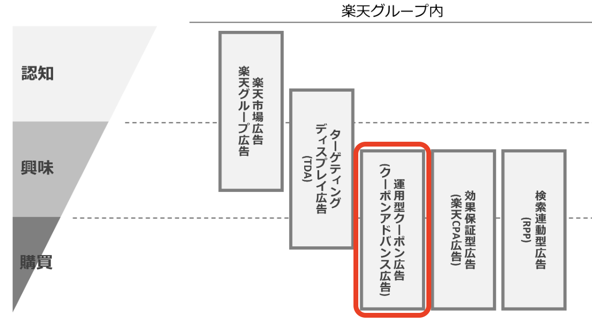
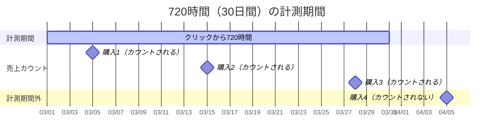

# クーポンアドバンス広告（運用型クーポン広告）のデータ項目まとめ

## この記事の対象

- データの定義を把握し、パフォーマンスレポートを適切に把握したい方

## この記事で得られること

- クーポンアドバンス広告の仕組みと課金形態の理解
- パフォーマンスレポートの全データ項目の意味
- 集計単位・集計期間ごとに表示される項目の違い

---

## 広告の概要

クーポンアドバンス広告は、ユーザーがクーポンを獲得した数に応じて課金される成果報酬型の広告。
楽天市場のトップページや検索結果、イベントページに掲載され、購入意欲の高いユーザーに自動でクーポンを配信してアプローチできるのが最大のメリット。

### 課金形態

| 項目 | 内容 |
|------|------|
| 課金方式 | クーポン獲得課金（ユーザーがクーポンを獲得した時点で課金） |
| 最低継続月予算 | 5,000円〜 |
| クーポン値引き | 店舗負担（自動または手動で設定） |

### 入札単価の設定範囲

入札単価は設定単位と配信商品設定によって異なる。

| 設定単位 | 説明 | 入札単価の範囲 |
|---------|------|--------------|
| キャンペーン | 各キャンペーンごとに設定可能なクーポン獲得単価 | 配信商品選定「自動」: 25円〜1,000円 / 配信商品選定「手動」: 40円〜1,000円 |
| 商品 | 各商品ごとに設定可能なクーポン獲得単価 | 配信商品選定「自動」: 25円〜1,000円 / 配信商品選定「手動」: 40円〜1,000円 |
| キーワード | 各キーワードごとに設定可能なクーポン獲得単価。楽天市場の検索結果およびその他キーワードマッチの掲載面で適用される | 40円〜1,000円（商品設定より1円以上高く設定する必要あり） |

楽天市場のトップページ、検索結果ページ、イベントページなどに掲載される。掲載面は楽天側が自動で選定するため、店舗側で指定することはできないとのこと。

### ターゲティングのロジック

購入意欲の高いユーザーのロジックってどうなってるんだろう？と個人的に疑問になったので少し調べてみた。

（公式に記載されていなかったのであくまで推測）楽天独自のアルゴリズムにより、購入見込みの高いユーザーが自動的に選別しているっぽい。
具体的には、商品や同一カテゴリの商品を直近で閲覧したかどうか、お気に入りに登録しているかどうかといった行動履歴から購買意欲の高さを判定してたり。
関連キーワードの検索履歴や、同一カテゴリでの過去の購入実績も加味することで、リピート購入が見込めるユーザーへの再訴求も行っている。

楽天ほどの規模のプラットフォームなら購入履歴のデータ量も相当あるはずなので、そこから購買傾向を類推してカテゴライズする仕組みは、かなり効果が大きいんじゃないかと思う。

---

## パフォーマンスレポートの集計単位と集計期間

パフォーマンスレポートは4つの集計単位で確認でき、集計単位によって利用できる集計期間が異なる。

| 集計単位 | 説明 | 月ごと | 指定期間（日単位も可能） |
|---------|------|:---:|:---:|
| 全ての広告 | 指定した期間に開催している全てのキャンペーンを合算した実績を確認できる | o | o |
| キャンペーン | 指定した期間に開催しているキャンペーンごとの実績を確認できる | o | o |
| 商品別 | 指定した期間に配信した商品ごとの実績を確認できる | o | o |
| キーワード別 | 指定した期間に配信したキーワードごとの実績を確認できる | o | o |

※ 指定期間は商品別・キーワード別は1ヶ月以内で設定可能。キャンペーンは3ヶ月以内で設定可能。
※ キャンペーンの「継続月予算」「消化率」は月ごとの集計でのみ表示される。指定期間では表示されない。

---

## 集計単位ごとのデータ項目

### 1. キャンペーン

指定した期間に開催しているキャンペーンごとの実績を確認できる。

#### ダミーデータ（月ごと）

**基本項目**

| 日付 | キャンペーンID | キャンペーン名 | 配信商品設定 | 設定値引率 | 除外商品リスト | 継続月予算 | 入札単価 |
|------|-------------|-------------|-----------|----------|-------------|----------|---------|
| 2026-03 | 10001 | 春の新生活キャンペーン | 自動 | 自動 | 適用あり | 50,000円 | 60円 |
| 2026-03 | 10002 | 定番商品キャンペーン | 手動 | 10% | 適用なし | 30,000円 | 45円 |

**実績項目**

| キャンペーン名 | クーポン獲得数 | 実績額 | クーポン獲得単価 | 消化率 |
|-------------|-------------|-------|---------------|-------|
| 春の新生活キャンペーン | 100 | 6,000円 | 60円 | 12% |
| 定番商品キャンペーン | 50 | 3,000円 | 60円 | 10% |

**効果項目1（クーポン利用）**

| キャンペーン名 | クーポン利用枚数 | クーポン利用率 | 値引コスト | 値引率 | 売上金額（クーポン掲載商品） |
|-------------|--------------|-------------|----------|-------|----------------------|
| 春の新生活キャンペーン | 30 | 30.0% | 9,000円 | 10% | 90,000円 |
| 定番商品キャンペーン | 15 | 30.0% | 4,500円 | 10% | 45,000円 |

**効果項目2（店舗全体の売上）**

| キャンペーン名 | 売上金額 | 売上件数 | 平均注文単価 | ROAS | ROAS（値引コスト含む） |
|-------------|--------|--------|-----------|------|-------------------|
| 春の新生活キャンペーン | 120,000円 | 30 | 4,000円 | 2,000% | 800% |
| 定番商品キャンペーン | 60,000円 | 15 | 4,000円 | 2,000% | 800% |

#### ダミーデータ（指定期間）

月ごとで表示される「継続月予算」「消化率」は表示されない。

**基本項目**

| 日付 | キャンペーンID | キャンペーン名 | 配信商品設定 | 設定値引率 | 除外商品リスト | 入札単価 |
|------|-------------|-------------|-----------|----------|-------------|---------|
| 2026-03-01 | 10001 | 春の新生活キャンペーン | 自動 | 自動 | 適用あり | 60円 |
| 2026-03-01 | 10002 | 定番商品キャンペーン | 手動 | 10% | 適用なし | 45円 |

**実績項目**

| キャンペーン名 | クーポン獲得数 | 実績額 | クーポン獲得単価 |
|-------------|-------------|-------|---------------|
| 春の新生活キャンペーン | 35 | 2,100円 | 60円 |
| 定番商品キャンペーン | 18 | 1,080円 | 60円 |

**効果項目1（クーポン利用）**

| キャンペーン名 | クーポン利用枚数 | クーポン利用率 | 値引コスト | 値引率 | 売上金額（クーポン掲載商品） |
|-------------|--------------|-------------|----------|-------|----------------------|
| 春の新生活キャンペーン | 10 | 28.6% | 3,000円 | 10% | 30,000円 |
| 定番商品キャンペーン | 5 | 27.8% | 1,500円 | 10% | 15,000円 |

**効果項目2（店舗全体の売上）**

| キャンペーン名 | 売上金額 | 売上件数 | 平均注文単価 | ROAS | ROAS（値引コスト含む） |
|-------------|--------|--------|-----------|------|-------------------|
| 春の新生活キャンペーン | 40,000円 | 10 | 4,000円 | 1,905% | 784% |
| 定番商品キャンペーン | 20,000円 | 5 | 4,000円 | 1,852% | 775% |

#### 項目説明

| 項目名 | 説明 |
|--------|------|
| 日付 | レポートの対象日付 |
| キャンペーンID | キャンペーンの識別ID |
| キャンペーン名 | 登録したキャンペーン名 |
| 配信商品設定 | キャンペーンの配信商品の設定ステータス。「自動」か「手動」のいずれかが表示される |
| 設定値引率 | キャンペーンの値引率の設定ステータス。自動の場合は「自動」、手動の場合は設定した一律の値引率が表示される |
| 除外商品リスト | 除外商品リストの適用ステータス。除外商品を適用しているか、していないかが表示される |
| 継続月予算 | 継続月予算として設定している金額。翌月も同額の予算で配信される。最低5,000円から設定可能。**月ごとの集計でのみ表示** |
| 入札単価 | キャンペーンごとに設定した1クーポン獲得あたりの単価 |
| クーポン獲得数 | ユーザーがクーポンを獲得した回数。この数が課金対象となる |
| 実績額 | クーポン獲得数に対して発生した広告費用の合計 |
| クーポン獲得単価 | 1獲得あたりの広告コスト（実績額 / クーポン獲得数） |
| 消化率 | 継続月予算に対する実績額の消化割合。**月ごとの集計でのみ表示** |
| クーポン利用枚数 | 獲得されたクーポンが実際に使われた枚数 |
| クーポン利用率 | クーポン利用枚数 / クーポン獲得数 × 100 |
| 値引コスト | クーポン利用による店舗負担の値引き額合計 |
| 値引率 | 商品価格に対するクーポン値引きの割合 |
| 売上金額（クーポン掲載商品） | クーポンが設定された商品の値引前の売上合計。ラストクリックがクーポンアドバンス広告でなくても、クーポンが利用されていれば反映される |
| 売上金額 | ラストクリックされた広告経由で獲得した全ての値引前の売上金額。クーポン掲載商品以外の店舗内商品も含む |
| 売上件数 | 広告経由の注文件数 |
| 平均注文単価 | 1注文あたりの平均金額（売上金額 / 売上件数） |
| ROAS | 売上金額 / 実績額 × 100 |
| ROAS（値引コスト含む） | 売上金額 /（実績額 + 値引コスト）× 100 |

---

### 2. 商品別

指定した期間に配信した商品ごとの実績を確認できる。

#### ダミーデータ

**基本項目**

| 日付 | 商品ページURL | 商品管理番号 | 入札単価 |
|------|-------------|-----------|---------|
| 2026-03-01 | https://item.rakuten.co.jp/shop/item-001/ | item-001 | 60円 |
| 2026-03-01 | https://item.rakuten.co.jp/shop/item-002/ | item-002 | 45円 |

**実績項目**

| 商品管理番号 | クーポン獲得数 | 実績額 | クーポン獲得単価 |
|-----------|-------------|-------|---------------|
| item-001 | 80 | 4,800円 | 60円 |
| item-002 | 70 | 3,150円 | 45円 |

**効果項目1（クーポン利用）**

| 商品管理番号 | クーポン利用枚数 | クーポン利用率 | 値引コスト | 値引率 | 売上金額（クーポン掲載商品） |
|-----------|--------------|-------------|----------|-------|----------------------|
| item-001 | 24 | 30.0% | 7,200円 | 10% | 72,000円 |
| item-002 | 21 | 30.0% | 6,300円 | 10% | 63,000円 |

**効果項目2（店舗全体の売上）**

| 商品管理番号 | 売上金額 | 売上件数 | 平均注文単価 | ROAS | ROAS（値引コスト含む） |
|-----------|--------|--------|-----------|------|-------------------|
| item-001 | 96,000円 | 24 | 4,000円 | 2,000% | 800% |
| item-002 | 84,000円 | 21 | 4,000円 | 2,667% | 889% |

#### 項目説明

| 項目名 | 説明 |
|--------|------|
| 日付 | レポートの対象日付 |
| 商品ページURL | 対象商品の商品ページURL |
| 商品管理番号 | 対象商品の商品管理番号 |
| 入札単価 | その商品に適用されている入札単価 |
| クーポン獲得数 | ユーザーがクーポンを獲得した回数。この数が課金対象となる |
| 実績額 | クーポン獲得数に対して発生した広告費用の合計 |
| クーポン獲得単価 | 1獲得あたりの広告コスト（実績額 / クーポン獲得数） |
| クーポン利用枚数 | 獲得されたクーポンが実際に使われた枚数 |
| クーポン利用率 | クーポン利用枚数 / クーポン獲得数 × 100 |
| 値引コスト | クーポン利用による店舗負担の値引き額合計 |
| 値引率 | 商品価格に対するクーポン値引きの割合 |
| 売上金額（クーポン掲載商品） | クーポンが設定された商品の値引前の売上合計。ラストクリックがクーポンアドバンス広告でなくても、クーポンが利用されていれば反映される |
| 売上金額 | ラストクリックされた広告経由で獲得した全ての値引前の売上金額。クーポン掲載商品以外の店舗内商品も含む |
| 売上件数 | 広告経由の注文件数 |
| 平均注文単価 | 1注文あたりの平均金額（売上金額 / 売上件数） |
| ROAS | 売上金額 / 実績額 × 100 |
| ROAS（値引コスト含む） | 売上金額 /（実績額 + 値引コスト）× 100 |

---

### 3. キーワード別

指定した期間に配信したキーワードごとの実績を確認できる。

#### ダミーデータ

**基本項目**

| 日付 | 商品ページURL | 商品管理番号 | キーワード | 設定値引率 | キーワード入札単価 |
|------|-------------|-----------|----------|----------|---------------|
| 2026-03-01 | https://item.rakuten.co.jp/shop/item-001/ | item-001 | 収納ボックス | 10% | 50円 |
| 2026-03-01 | https://item.rakuten.co.jp/shop/item-001/ | item-001 | おしゃれ 収納 | 15% | 65円 |

**実績項目**

| キーワード | クーポン獲得数 | 実績額 | クーポン獲得単価 |
|----------|-------------|-------|---------------|
| 収納ボックス | 40 | 2,000円 | 50円 |
| おしゃれ 収納 | 25 | 1,625円 | 65円 |

**効果項目1（クーポン利用）**

| キーワード | クーポン利用枚数 | クーポン利用率 | 値引コスト | 値引率 | 売上金額（クーポン掲載商品） |
|----------|--------------|-------------|----------|-------|----------------------|
| 収納ボックス | 12 | 30.0% | 3,600円 | 10% | 36,000円 |
| おしゃれ 収納 | 8 | 32.0% | 3,600円 | 15% | 24,000円 |

**効果項目2（店舗全体の売上）**

| キーワード | 売上金額 | 売上件数 | 平均注文単価 | ROAS | ROAS（値引コスト含む） |
|----------|--------|--------|-----------|------|-------------------|
| 収納ボックス | 48,000円 | 12 | 4,000円 | 2,400% | 857% |
| おしゃれ 収納 | 32,000円 | 8 | 4,000円 | 1,969% | 612% |

#### 項目説明

| 項目名 | 説明 |
|--------|------|
| 日付 | レポートの対象日付 |
| 商品ページURL | 対象商品の商品ページURL |
| 商品管理番号 | 対象商品の商品管理番号 |
| キーワード | 入札設定したキーワード |
| 設定値引率 | キーワードごとの値引率の設定。自動の場合は「自動」、手動の場合は設定した値引率が表示される |
| キーワード入札単価 | キーワードごとに設定した入札単価。商品設定より1円以上高く設定する必要がある |
| クーポン獲得数 | ユーザーがクーポンを獲得した回数。この数が課金対象となる |
| 実績額 | クーポン獲得数に対して発生した広告費用の合計 |
| クーポン獲得単価 | 1獲得あたりの広告コスト（実績額 / クーポン獲得数） |
| クーポン利用枚数 | 獲得されたクーポンが実際に使われた枚数 |
| クーポン利用率 | クーポン利用枚数 / クーポン獲得数 × 100 |
| 値引コスト | クーポン利用による店舗負担の値引き額合計 |
| 値引率 | 商品価格に対するクーポン値引きの割合 |
| 売上金額（クーポン掲載商品） | クーポンが設定された商品の値引前の売上合計。ラストクリックがクーポンアドバンス広告でなくても、クーポンが利用されていれば反映される |
| 売上金額 | ラストクリックされた広告経由で獲得した全ての値引前の売上金額。クーポン掲載商品以外の店舗内商品も含む |
| 売上件数 | 広告経由の注文件数 |
| 平均注文単価 | 1注文あたりの平均金額（売上金額 / 売上件数） |
| ROAS | 売上金額 / 実績額 × 100 |
| ROAS（値引コスト含む） | 売上金額 /（実績額 + 値引コスト）× 100 |

---

## データ項目に関する注意点

### クーポン獲得日と利用日のズレ

クーポン獲得のデータはクーポン獲得日に紐づき、クーポン利用のデータは利用日に紐づく。そのため、クーポンが獲得された日と利用された日が一致しない場合がある。

例: 10月31日にクーポンが1枚獲得され、そのクーポンが11月1日に利用された場合、10月31日にクーポン獲得数1とカウントされ、11月1日に利用枚数1としてカウントされる。

### 売上の計測期間

売上の計測はラストクリック基準。クーポンアドバンス広告をクリックした後に他の広告をクリックした場合、売上はクーポンアドバンス広告には反映されない。あくまでラストクリックがクーポンアドバンス広告の場合にのみ売上が帰属する。また、広告経由でクリックされた商品以外の店舗内商品が購入された場合も、売上としてカウントされる。

計測期間はクリックから720時間（30日間）あるので、その間は実績が後から増えることがある。同じユーザーが720時間以内に何回か買えば、その分全部カウントされる。

